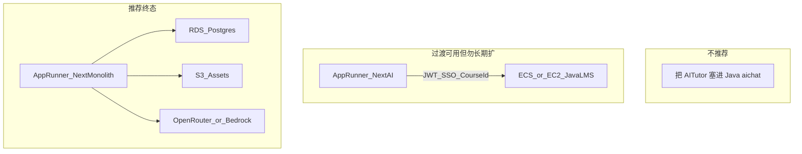
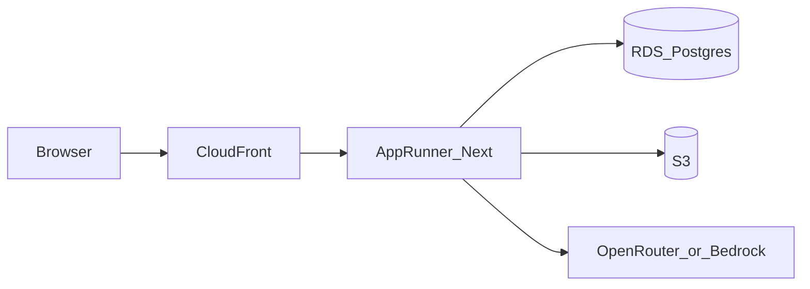

# Learning Guide × AITutor 架构设计

**状态**：已确认（选型 C — 全量 Next.js）  
**日期**：2026-08-03  
**主仓**：GitHub [Ashley-AIHR/LearningGuide](https://github.com/Ashley-AIHR/LearningGuide)（产品唯一主仓；App Runner 部署源）  
**相关源码**：

- Learning Guide MVP（参考/待退役）：本机仓库 `learning-guide-admin` + `learning-guide-backend`
- AITutor 基线（已并入主仓）：[Ashley-AIHR/AITutor](https://github.com/Ashley-AIHR/AITutor.git)；本地参考 `/Users/mayongning/Documents/Codex/2026-06-07/files-mentioned-by-the-user-ks/demo-ai-tutor`

配套实施计划见 [implementation-plan-nextjs-migration.md](./implementation-plan-nextjs-migration.md)。

---

## 1. 结论

- **可以集成**，而且以当前两边代码量来看，**全量迁到 Next.js 完全可行**。
- **推荐路径**：以 AITutor（Next.js）为 **系统主应用（AWS App Runner）**，把 Learning Guide 已落地的用户/课程/订单/管理能力 **迁移进同一 Next.js 代码库**；Java 后端 **冻结新功能**，仅作过渡或最终退役。
- **不推荐**：把 AITutor 的 LLM/流式/知识 Wiki 管线重写成 Spring；也不推荐长期「Java LMS + Next AI」双栈扩张。

### 1.1 现状快照

| 系统 | 形态 | 体量/成熟度 |
|------|------|-------------|
| Learning Guide | Vue3 Admin + Spring Boot 多模块 + MySQL | ~126 个 Java 源文件；`aichat` / `assessment` / `payment` / `discussion` / `learning` / `support` **均为空壳**；Admin 有 NFC/Voice/Scene API 调用，后端未见对等实现 |
| AITutor | Next.js 15 + Route Handlers + OpenRouter 流式 + Docker/App Runner | ~11k+ TS/TSX；已有知识准备→LLM Draft→Wiki→Publish→Dialogue/Chat Testing；持久化支持本地文件 / Postgres(`app_files`) / S3 |

两边「课程」概念不同：Learning Guide 是 LMS（category / lesson / section / orders）；AITutor 是 **Course → Knowledge pack → Wiki/对话运行时**。集成本质是 **领域模型对齐 + 身份/权限打通**，不是简单 iframe。

---

## 2. 三种架构选项与选型

### 选项 A — 嵌入 Java（拒绝）

在空的 `aichat` 模块重写流式代理、prompt、wiki、材料抽取。工作量接近重做 AITutor，且与 App Runner 目标冲突。

### 选项 B — 双服务混合（仅短期）

- Next AITutor：App Runner（已有 `Dockerfile`、`apprunner.yaml`）
- Java LMS：另容器/实例跑 `web` / `admin` / `teacher`
- 通过共享 JWT issuer、课程 ID 映射、API Gateway / CloudFront 拼装

适合「两周内要联调演示」；长期维护成本高（两套 CI、两套鉴权、两套数据模型）。

### 选项 C — 全量 Next.js（推荐终态，已确认）

单一 Next.js 应用承载：

1. **AI 运行时**（现有 AITutor 管线原样保留为 tutor 模块）
2. **LMS/运营**（从 Learning Guide 迁：Admin / Teacher / Student、Course 目录、Orders、内容树）
3. **统一 Auth**（NextAuth 或自研 JWT，角色：admin / teacher / student）
4. **统一数据**：Postgres（结构化 LMS 表 + 现有 `app_files` VFS）+ S3（大文件/视频）

**默认假设**：产品战略重心是 AI Tutor / 知识管线；Learning Guide 的 NFC / Voice / Scene / 会员角色多为前端占位，**不纳入第一期迁移范围**（可后续加）。

---

## 3. 目标架构（选项 C）

### 3.1 模块边界（单仓）

- `app/(tutor)/...` — 现有 AITutor 路由与 API（wiki / draft / dialogue / chat）
- `app/(lms)/...` — 学生/教师/管理端（由 Vue Admin + web API 重写）
- `lib/auth` — 会话与 RBAC
- `lib/db` — Prisma/Drizzle：`users` / `courses` / `enrollments` / `orders` + 映射到 AITutor `courseId` / `knowledgeId`
- `services/*` — 保留 AITutor 的 store/VFS 模式；LMS CRUD 用关系表，避免把订单塞进文件 VFS

### 3.2 领域对齐（关键设计）

- Learning Guide `tb_course` ↔ AITutor `Course`：一对一，或「一个 LMS Course 下多个 Knowledge」
- 发布物（Wiki release）绑定 `knowledgeId`，学生对话权限查 `enrollment` / `order` 状态
- 教师素材上传：统一走 S3，元数据进 Postgres；AITutor 的 source-materials 管线复用

---

## 4. 评估维度对比

以下对 **Java 嵌入 AI / 双栈混合 / 全 Next** 的判断（高 = 更好）：

### 可维护性

- **全 Next**：一套语言、一套部署、一套类型。AITutor 已是主体代码。
- **双栈**：接口契约与发布节奏永远打架。
- **Java 嵌入 AI**：流式、prompt 迭代、工具链最差。

### 敏捷性

- **Next** Route Handlers + 前端同仓：AI 产品迭代最快（AITutor 已证明）。
- **Java** 多模块 + 空壳模块：新 AI 能力启动成本高。

### 前瞻性 / 未来证明

- App Runner + 容器化 Next 已验证；可再拆 Worker（长任务转写/批量 draft）而不改产品面。
- 纯 Java 胖部署与团队「AWS App Runner」方向相反。

### AI / LLM 兼容性

- **Next**：原生 SSE/streaming、OpenRouter、可换 Bedrock；prompt 以 markdown 文件热编辑（AITutor 现有模式）。
- **Java**：Spring WebFlux/MVC 也能做流式，但生态与现有 demo 不对齐，等于重写。

### 与 AI-native 编码方式的亲和

- TS / React / Next 是 Cursor / Copilot 训练与示例密度最高的栈之一；AITutor 已是「文件型 store + 薄 API」结构，适合 agent 改。
- Java + MyBatis 多模块：样板多、跨模块跳转多，agent 易漏改。

### AI 编码 Token 效率

- 单仓 TS、边界清晰：上下文更小、重复少。
- 双栈：每次改动要同时加载 Vue + Java + Next，token 浪费大。
- 全 Java 重写 AI：提示词与流式调试循环更长。

### CI/CD 可操作性

- **Next**：`npm ci && npm run build` → 推 ECR → App Runner（AITutor 已有 Docker / apprunner）。
- **Java**：多模块 Maven + 可能多进程（web / admin / teacher）→ 更适合 ECS/EKS，运维面更大。
- **混合**：两套流水线、两套密钥、两套健康检查。

**综合**：若目标是 App Runner + AI 产品速度，**全 Next 完胜**；Learning Guide 体量小，迁移窗口现在最便宜。

---

## 5. 工作量估算（全量迁 Next 是否可能？）

**结论：可能。** Learning Guide 不是大型遗留系统；多数后端模块为空，真正要搬的是已实现切片。

按 **1 名全栈、熟悉两边代码** 粗估（人周）：

1. **基建（1–1.5 周）**  
   单仓整理、Auth、Postgres schema、S3、App Runner 流水线、环境密钥。

2. **LMS 核心迁移（3–5 周）**  
   用户/教师/管理员、课程/分类/内容树、订单与选课、管理后台 UI（替代 Vue Admin 核心页）。  
   参考：Java ~126 文件、Admin 前端 ~6k 行；NFC / Voice / Scene / MemberRole **排除**。

3. **与 AITutor 领域打通（1.5–2.5 周）**  
   Course / Knowledge 映射、发布门禁、角色权限、会话与学习记录挂钩。

4. **硬化与上线（1–2 周）**  
   流式超时、文件上传限制、观测（日志/告警）、数据迁移脚本、UAT。

| 范围 | 日历时间（约） | 人周（约） |
|------|----------------|------------|
| 仅把 AITutor 上 App Runner + 深链到现有 LG（演示） | 3–7 天 | 0.5–1 |
| 双栈混合生产可用（SSO + ID 映射 + 网关） | 3–5 周 | 3–5 |
| **全 Next：AITutor + LG 已实现核心**（推荐） | **7–11 周** | **7–11** |
| 再含 NFC / Voice / Scene / 会员体系 / 真实支付 | +4–8 周 | +4–8 |

风险缓冲：订单/支付若要做到生产级微信 / Stripe，单独加 2–4 周（当前 `payment` 模块为空）。

**不可能的情况只有**：要求「零停机、功能 100% 含未实现的 NFC/支付/测评，且 2 周内切完」——那不现实；分阶段则现实。

---

## 6. 建议落地节奏

1. **Week 0**：冻结 Java 新功能；以 AITutor 仓为 monorepo 基线（或将 Learning Guide 作为参考导入）。
2. **Phase 1**：App Runner 部署 AITutor 生产骨架（Postgres + S3 持久化，告别纯本地 `data/`）。
3. **Phase 2**：迁 Auth + Course / Enrollment；Admin 最小可用。
4. **Phase 3**：Orders + 学生入口；对话前校验权益。
5. **Phase 4**：下线 Vue Admin 与 Java 进程；MySQL → Postgres 迁移或双写结束后切流。

过渡期若必须保留 Java：**只读/只写 LMS**，AI 流量 100% 走 Next，避免在 Java 里长出第二套 LLM。

---

## 7. 明确不做什么（本期）

- 不把 OpenRouter 调用搬进 Spring。
- 不重写 AITutor 的 wiki / draft 管线。
- 不把 NFC / Voice / Scene 当作迁移阻塞项。
- 不在 App Runner 上跑多模块 JVM 集群作为主路径。

---

## 8. 后续文档

- 分阶段实施计划（schema、目录、CI、里程碑）：[implementation-plan-nextjs-migration.md](./implementation-plan-nextjs-migration.md)
