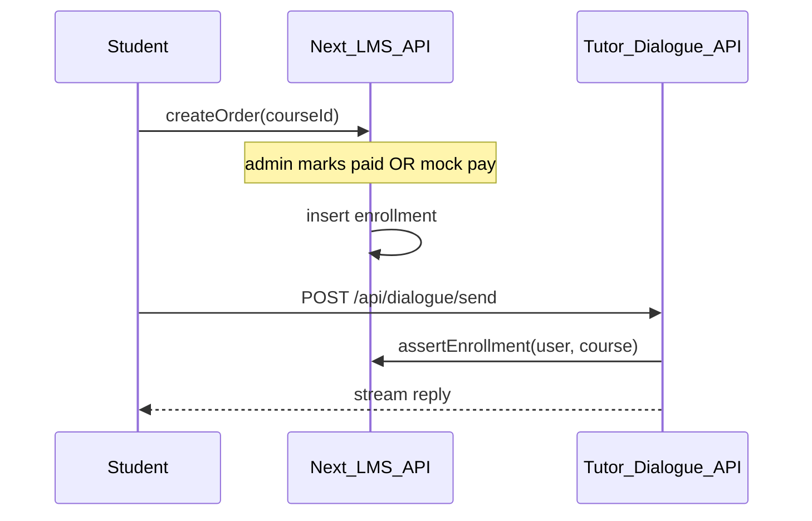

# Learning Guide → Next.js（AITutor）分阶段实施计划

**状态**：已确认选型 C  
**依据**：[architecture-ai-tutor-integration.md](./architecture-ai-tutor-integration.md)  
**目标工期**：约 7–11 人周（1 名全栈，核心范围；不含 NFC/Voice/Scene/生产级支付）  
**主仓**：GitHub [Ashley-AIHR/LearningGuide](https://github.com/Ashley-AIHR/LearningGuide)  
**基线代码**：AITutor（[Ashley-AIHR/AITutor](https://github.com/Ashley-AIHR/AITutor.git)）已作为 Next.js 起点并入主仓；本机 Learning Guide Java/Vue MVP 仅作行为与数据参考，最终退役。

---

## 0. Week 0 — 准备与冻结

### 目标

- 冻结 `learning-guide-backend` / `learning-guide-admin` 新功能开发。
- 确定产品仓与分支策略。
- 对齐环境与密钥清单。

### 动作

1. 使用主仓 [Ashley-AIHR/LearningGuide](https://github.com/Ashley-AIHR/LearningGuide)（由 AITutor 基线初始化）；本机 Java/Vue MVP 只读参考。
2. 建立分支：`main`（可部署）、`develop`（集成）、`feat/*`（功能）。
3. 文档化环境变量（App Runner secrets）：

| 变量 | 用途 |
|------|------|
| `DATABASE_URL` | RDS Postgres |
| `DATABASE_SSL` | 本地可 `0` |
| `AWS_REGION` / `S3_BUCKET` / 凭证 | 素材与大文件 |
| `OPENROUTER_API_KEY` | LLM |
| `AUTH_SECRET` / JWT 相关 | 会话 |
| `PORT=8080` | App Runner 约定 |

4. 盘点 Learning Guide MySQL 表（`tb_*`）与是否有生产数据需迁移。

### 完成标准

- [ ] 主仓可 `npm ci && npm run build`
- [ ] Java/Vue 仓库标记 read-only（README 或团队约定）
- [ ] 密钥清单评审通过

---

## 1. Phase 1 — 生产骨架（1–1.5 周）

### 目标

AITutor 在 App Runner 上可稳定运行，持久化离开本机 `data/`。

### 目录（目标布局）

在 AITutor 仓内逐步收敛为：

```text
/
  app/
    (tutor)/          # 现有 tutor 页面（可先保留扁平路由，再移入 route group）
    (lms)/            # Phase 2+ 新增
    api/              # 现有 + 后续 /api/lms/*
  components/
  config/
  knowledge/          # 默认知识包（只读种子）
  prompts/
  lib/
    auth/             # Phase 2
    db/               # Prisma/Drizzle client + schema
  services/           # 现有 store/VFS；逐步接 persistence
  sql/
  Dockerfile
  apprunner.yaml
  .github/workflows/deploy.yml
```

Phase 1 **不强制**移动现有 `app/` 路由；优先打通持久化与 CI。

### Schema（最小）

保留并启用现有 VFS 表（已有 `sql/001_app_files.sql` / `services/persistence`）：

```sql
-- app_files：AITutor 文件型 store 的云端后端
CREATE TABLE IF NOT EXISTS app_files (
  path TEXT PRIMARY KEY,
  storage TEXT NOT NULL CHECK (storage IN ('db', 's3')),
  content TEXT,
  s3_key TEXT,
  byte_size INTEGER NOT NULL DEFAULT 0,
  content_type TEXT NOT NULL DEFAULT 'application/octet-stream',
  updated_at TIMESTAMPTZ NOT NULL DEFAULT NOW()
);
CREATE INDEX IF NOT EXISTS app_files_path_prefix_idx ON app_files (path text_pattern_ops);
```

### CI/CD

流水线建议：

1. PR：`npm ci` → `npm run lint` → `npm run build`
2. `main` 合并：Docker build → push ECR → 更新 App Runner 服务
3. 健康检查：`GET /api/health/persistence`（已有）+ 新增 `GET /api/health`

Dockerfile 沿用 AITutor 多阶段构建；运行端口 **8080**。

### 完成标准

- [ ] 生产环境 `DATABASE_URL` + S3 配置生效
- [ ] 上传材料 / 保存 wiki draft / 发布 release 重启后数据仍在
- [ ] App Runner 自动部署跑通至少一次
- [ ] OpenRouter 流式对话在生产域名可用

---

## 2. Phase 2 — Auth + Course / Enrollment + Admin 最小集（3–4 周）

### 目标

统一身份与课程目录；管理端可维护用户与课程，并映射到 AITutor `courseId` / `knowledgeId`。

### Schema（LMS 核心）

```sql
CREATE TABLE users (
  id            BIGSERIAL PRIMARY KEY,
  email         TEXT UNIQUE,
  phone         TEXT UNIQUE,
  password_hash TEXT,
  display_name  TEXT NOT NULL,
  role          TEXT NOT NULL CHECK (role IN ('admin', 'teacher', 'student')),
  status        TEXT NOT NULL DEFAULT 'active',
  created_at    TIMESTAMPTZ NOT NULL DEFAULT NOW(),
  updated_at    TIMESTAMPTZ NOT NULL DEFAULT NOW()
);

CREATE TABLE categories (
  id         BIGSERIAL PRIMARY KEY,
  name       TEXT NOT NULL,
  sort_order INT NOT NULL DEFAULT 0,
  deleted    BOOLEAN NOT NULL DEFAULT FALSE
);

-- LMS 课程；tutor_course_id 对齐 AITutor services/courseStore 的 id
CREATE TABLE courses (
  id              BIGSERIAL PRIMARY KEY,
  title           TEXT NOT NULL,
  category_id     BIGINT REFERENCES categories(id),
  teacher_id      BIGINT REFERENCES users(id),
  description     TEXT,
  cover_url       TEXT,
  status          TEXT NOT NULL DEFAULT 'draft', -- draft|published|archived
  tutor_course_id TEXT UNIQUE,                  -- e.g. philosophy
  deleted         BOOLEAN NOT NULL DEFAULT FALSE,
  created_at      TIMESTAMPTZ NOT NULL DEFAULT NOW(),
  updated_at      TIMESTAMPTZ NOT NULL DEFAULT NOW()
);

-- 一个 LMS course 下多个 knowledge pack
CREATE TABLE knowledge_links (
  id                 BIGSERIAL PRIMARY KEY,
  course_id          BIGINT NOT NULL REFERENCES courses(id),
  tutor_knowledge_id TEXT NOT NULL,             -- e.g. epicureanism
  title              TEXT NOT NULL,
  UNIQUE (course_id, tutor_knowledge_id)
);

CREATE TABLE enrollments (
  id          BIGSERIAL PRIMARY KEY,
  user_id     BIGINT NOT NULL REFERENCES users(id),
  course_id   BIGINT NOT NULL REFERENCES courses(id),
  source      TEXT NOT NULL DEFAULT 'manual', -- manual|order|import
  status      TEXT NOT NULL DEFAULT 'active',
  created_at  TIMESTAMPTZ NOT NULL DEFAULT NOW(),
  UNIQUE (user_id, course_id)
);

CREATE TABLE content_nodes (
  id         BIGSERIAL PRIMARY KEY,
  course_id  BIGINT NOT NULL REFERENCES courses(id),
  parent_id  BIGINT REFERENCES content_nodes(id),
  node_type  TEXT NOT NULL, -- section|lesson|content
  title      TEXT NOT NULL,
  sort_order INT NOT NULL DEFAULT 0,
  payload    JSONB NOT NULL DEFAULT '{}',
  deleted    BOOLEAN NOT NULL DEFAULT FALSE
);
```

从 Learning Guide 映射参考：

| LG（MySQL） | Next（Postgres） |
|-------------|------------------|
| `tb_admin` / `tb_teacher` / user | `users.role` |
| `tb_course` | `courses` + `tutor_course_id` |
| category | `categories` |
| content / content_node / lesson / section | `content_nodes` |
| `tb_user_course` | `enrollments` |

### 目录与 API

```text
app/(lms)/
  admin/users/page.tsx
  admin/courses/page.tsx
  admin/categories/page.tsx
  teacher/courses/page.tsx
  login/page.tsx
app/api/lms/
  auth/login/route.ts
  users/route.ts
  courses/route.ts
  categories/route.ts
  enrollments/route.ts
lib/auth/
  session.ts
  rbac.ts
  password.ts
```

### Auth 设计

- 会话：HTTP-only cookie（推荐）或与现有 LG 兼容的 JWT，**单一 issuer**。
- RBAC 中间件：保护 `/api/lms/*` 与 tutor 写操作（draft/publish）；学生只读已发布 knowledge + dialogue。
- 创建 LMS `courses` 时同步调用现有 `createCourse` / `ensureKnowledgeDirs`（`services/courseStore`）。

### 完成标准

- [ ] admin / teacher / student 可登录
- [ ] Admin 可 CRUD 课程与分类，并生成/绑定 `tutor_course_id`
- [ ] Teacher 只能管理自己的课程
- [ ] Student 仅看到已 enrollment 的课程入口
- [ ] 未登录无法调用 wiki publish / draft generate

---

## 3. Phase 3 — Orders + 学生入口 + 对话权益（1.5–2.5 周）

### 目标

选课/订单驱动 enrollment；对话前校验权益。

### Schema

```sql
CREATE TABLE orders (
  id           BIGSERIAL PRIMARY KEY,
  order_no     TEXT NOT NULL UNIQUE,
  user_id      BIGINT NOT NULL REFERENCES users(id),
  course_id    BIGINT NOT NULL REFERENCES courses(id),
  amount_cents INT NOT NULL DEFAULT 0,
  currency     TEXT NOT NULL DEFAULT 'CNY',
  status       TEXT NOT NULL DEFAULT 'pending', -- pending|paid|cancelled|refunded
  paid_at      TIMESTAMPTZ,
  meta         JSONB NOT NULL DEFAULT '{}',
  created_at   TIMESTAMPTZ NOT NULL DEFAULT NOW(),
  updated_at   TIMESTAMPTZ NOT NULL DEFAULT NOW()
);

CREATE INDEX orders_user_id_idx ON orders(user_id);
CREATE INDEX orders_status_idx ON orders(status);
```

本期支付：支持 **手动标记 paid**（运营后台）或 mock checkout；**不**实现微信/Stripe 全链路（见后续加项）。

### 产品流



### 目录

```text
app/(lms)/
  student/courses/page.tsx
  student/orders/page.tsx
  admin/orders/page.tsx
app/api/lms/
  orders/route.ts
  orders/[id]/pay/route.ts   # mock or admin confirm
```

### 完成标准

- [ ] 下单 → 支付确认 → 自动 enrollment
- [ ] 无 enrollment 时 dialogue / chat 返回 403
- [ ] 学生端可进入已购课程的 knowledge 对话页
- [ ] Admin 订单列表可用（对标 LG `OrdersList`）

---

## 4. Phase 4 — 数据迁移、切流、退役 Java（1–2 周）

### 目标

若有 MySQL 存量数据则迁移；生产流量切到 Next；下线 JVM 与 Vue Admin。

### 迁移脚本要点

1. 导出 LG：`users` / `teachers` / `admins` / `courses` / `categories` / `orders` / `user_course` / content 树。
2. 转换脚本（`scripts/migrate-from-lg.mjs`）：
   - 密码：若 LG 哈希算法不兼容，强制 reset 或一次性迁移 bcrypt。
   - 为每门课生成 `tutor_course_id`（slug），并 `ensureDefaultData` / 创建 knowledge 目录。
3. 校验行数与抽样登录。
4. DNS / CloudFront 切到 App Runner；保留 Java 只读一周（可选）。

### 退役清单

- [ ] 停止 `web` / `admin` / `teacher` Spring 进程
- [ ] Vue Admin 仓库归档
- [ ] 本仓库 README 指向 AITutor 主仓与本文档
- [ ] 关闭旧 MySQL 写入账号

### 完成标准

- [ ] 生产仅 Next + Postgres + S3 + LLM
- [ ] UAT 用例通过（见下方 checklist）
- [ ] 回滚方案文档化（保留上一版 App Runner revision）

---

## 5. CI/CD 与运维明细

### GitHub Actions 草图

```yaml
# .github/workflows/deploy.yml（示意）
# on push to main:
#   - npm ci && npm run lint && npm run build
#   - docker build -t $ECR_REPO:$SHA .
#   - docker push
#   - aws apprunner start-deployment --service-arn $ARN
```

### App Runner

- Runtime: Docker，port `8080`
- CPU/Mem：起步 1 vCPU / 2 GB；流式对话观察超时（需调 idle timeout）
- 密钥：从 Secrets Manager / App Runner 环境注入，**禁止**写入镜像

### 观测

- 结构化日志：request id、user id、course/knowledge id、model id、latency
- 告警：5xx 率、持久化 health 失败、OpenRouter 错误率

### 本地开发

```bash
npm install
# .env.local: DATABASE_URL, OPENROUTER_API_KEY, AUTH_SECRET
npm run dev   # 约定端口与 AITutor README 一致（如 3007）
```

---

## 6. 里程碑总表

| 里程碑 | 周次（约） | 交付物 |
|--------|-----------|--------|
| M0 冻结与主仓 | Week 0 | 分支策略、密钥清单、只读约定 |
| M1 生产骨架 | Week 1–2 | App Runner + Postgres/S3 + CI 绿 |
| M2 Auth/LMS 目录 | Week 2–6 | 登录、课程、enrollment、Admin 最小 UI |
| M3 订单与权益 | Week 6–8 | Orders、学生入口、对话 403 门禁 |
| M4 切流退役 | Week 8–11 | 迁移脚本、UAT、下线 Java/Vue |

并行度：若 2 人，M2 UI 与 schema/API 可并行，总日历可压到约 **6–8 周**。

---

## 7. UAT Checklist（上线门禁）

- [ ] Admin 登录 / 创建教师 / 创建学生
- [ ] 创建课程 → 自动或手动绑定 tutor course + knowledge
- [ ] 上传 source materials → LLM draft → wiki 编辑 → publish → 下载 release
- [ ] 学生无订单无法对话；有 enrollment 可 Lecture/Socratic 流式对话
- [ ] 订单 mock 支付后立刻可学
- [ ] App Runner 重启后 wiki/课程数据不丢
- [ ] 角色越权用例全部拒绝

---

## 8. 明确排除（本期不加进工期）

- NFC / Voice / Scene / Member / MemberRole（Vue 占位）
- 真实微信支付 / Stripe
- Assessment / Discussion / 独立 Support 工单
- 将 LLM 逻辑迁回 Java

上述项若启动，按架构文档加估 **+4–8 人周**（支付另计 +2–4）。

---

## 9. 立即下一步（工程启动时）

1. ~~选定主仓位置~~ → 已定为 [Ashley-AIHR/LearningGuide](https://github.com/Ashley-AIHR/LearningGuide)。
2. 开通 RDS Postgres + S3 + App Runner 服务壳（部署源指向该仓）。
3. 落地 Phase 1：`DATABASE_URL` 接通与 CI workflow。
4. 开 Phase 2 第一个 PR：`lib/db` schema + `users` + login API。
